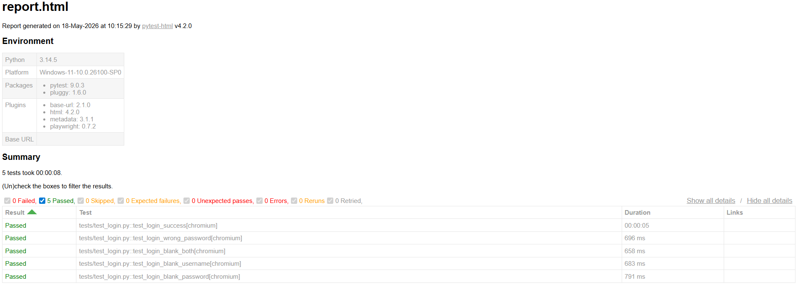
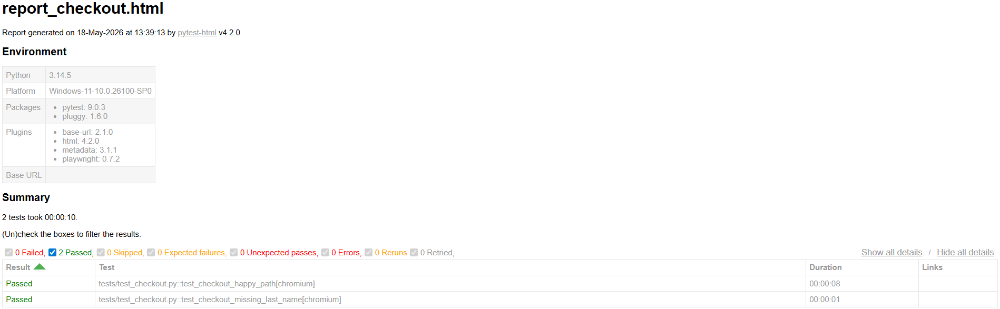

# 🧪 Automated UI Testing Portfolio

## 📌 Project Overview
โปรเจกต์นี้เป็นการจำลองการทำ Automated UI Testing สำหรับทดสอบระบบเว็บไซต์ E-commerce เพื่อตรวจสอบความถูกต้องของฟังก์ชันการทำงานหลัก โดยใช้ **Python** และ **Playwright** ในการสร้างสคริปต์จำลองพฤติกรรมของผู้ใช้งานจริง

## 🛠️ Tools & Technologies
- **Language:** Python
- **Testing Framework:** Playwright (Pytest)
- **Target Website:** [Swag Labs (saucedemo.com)](https://www.saucedemo.com/)

---

## 📋 Test Scenarios & Test Cases

### 🎯 Scenario: ทดสอบระบบเข้าสู่ระบบ (Login System)

#### 📝 TC-LOG-001: ตรวจสอบการเข้าสู่ระบบด้วยบัญชีที่ถูกต้อง (Happy Path)
- **Pre-conditions:** อยู่ที่หน้า URL `https://www.saucedemo.com/`
- **Test Steps:**
  1. กรอก Username: `standard_user`
  2. กรอก Password: `secret_sauce`
  3. คลิกปุ่ม "Login"
- **Expected Result:** - ระบบเปลี่ยนไปยังหน้าสินค้า (URL มีคำว่า `/inventory.html`)
  - มีข้อความ "Products" แสดงอยู่บนหน้าจอ

#### 📝 TC-LOG-002: ตรวจสอบการเข้าสู่ระบบเมื่อกรอกรหัสผ่านผิด (Negative Test)
- **Pre-conditions:** อยู่ที่หน้า URL `https://www.saucedemo.com/`
- **Test Steps:**
  1. กรอก Username: `standard_user`
  2. กรอก Password: `wrong_password123`
  3. คลิกปุ่ม "Login"
- **Expected Result:** - ระบบไม่เปลี่ยนหน้า
  - มีข้อความ Error สีแดงแจ้งเตือนว่า *Epic sadface: Username and password do not match any user in this service*

#### 📝 TC-LOG-003: ตรวจสอบการเข้าสู่ระบบเมื่อกรอกข้อมูลว่างเปล่าทั้งคู่ (Blank Test)
- **Pre-conditions:** อยู่ที่หน้า URL `https://www.saucedemo.com/`
- **Test Steps:**
  1. คลิกปุ่ม "Login" โดยไม่กรอกอะไรเลย
- **Expected Result:** - ระบบไม่เปลี่ยนหน้า
  - มีข้อความ Error สีแดงแจ้งเตือนว่า *Epic sadface: Username is required*

#### 📝 TC-LOG-004: ตรวจสอบการเข้าสู่ระบบเมื่อกรอกชื่อบัญชีว่างเปล่า (Username Blank Test)
- **Pre-conditions:** อยู่ที่หน้า URL `https://www.saucedemo.com/`
- **Test Steps:**
  1. กรอก Password: `secret_sauce`
  2. คลิกปุ่ม "Login" โดยไม่กรอกชื่อผู้ใช้
- **Expected Result:** - ระบบไม่เปลี่ยนหน้า
  - มีข้อความ Error สีแดงแจ้งเตือนว่า *Epic sadface: Username is required*

#### 📝 TC-LOG-005: ตรวจสอบการเข้าสู่ระบบเมื่อกรอกรหัสผ่านว่างเปล่า (Password Blank Test)
- **Pre-conditions:** อยู่ที่หน้า URL `https://www.saucedemo.com/`
- **Test Steps:**
  1. กรอก Username: `standard_user`
  2. คลิกปุ่ม "Login" โดยไม่กรอกรหัสผ่าน
- **Expected Result:** - ระบบไม่เปลี่ยนหน้า
  - มีข้อความ Error สีแดงแจ้งเตือนว่า *Epic sadface: Password is required*

## 📊 Test Report Result

---

### 🎯 Scenario: ทดสอบการทำงานของระบบ (Workflow System)

#### 📝 TC-WKF-001: ตรวจสอบการทำงานของระบบอย่างถูกต้อง (Happy Path)
- **Pre-conditions:** เข้าสู่ระบบด้วยบัญชีที่ถูกต้องและอยู่ที่หน้าสินค้า (/inventory.html)
- **Test Steps:**
  1. กดปุ่ม Add to cart ที่สินค้า "Sauce Labs Backpack" และ "Sauce Labs Bike Light"
  2. คลิกที่ไอคอนตะกร้าสินค้ามุมขวาบน
  3. คลิกปุ่ม "Checkout"
  4. กรอกข้อมูล First Name: John, Last Name: Doe, Zip/Postal Code: 12345
  5. คลิกปุ่ม "Continue"
  6. ตรวจสอบหน้ารวมยอด แล้วคลิกปุ่ม "Finish"
  7. คลิกปุ่ม "Back Home"
- **Expected Result:** - หลังจากกด Finish ระบบแสดงข้อความ "Thank you for your order!"
  - หลังจากกด Back Home ระบบเปลี่ยนกลับมาที่หน้าสินค้าหลัก (URL มีคำว่า /inventory.html)

#### 📝 TC-WKF-002: ตรวจสอบการเว้นว่างช่องกรอกที่อยู่ (Negative Test)
- **Pre-conditions:** เข้าสู่ระบบด้วยบัญชีที่ถูกต้องและอยู่ที่หน้าสินค้า (/inventory.html)
- **Test Steps:**
  1. กดปุ่ม Add to cart ที่สินค้า "Sauce Labs Backpack" และ "Sauce Labs Bike Light"
  2. คลิกที่ไอคอนตะกร้าสินค้ามุมขวาบน
  3. คลิกปุ่ม "Checkout"
  4. กรอกข้อมูล First Name: John, Last Name: , Zip/Postal Code: 12345
  5. คลิกปุ่ม "Continue"
- **Expected Result:** - หลังจากกด Continue ระบบแสดงข้อความ "Error: Last Name is required"

## 📊 Test Report Checkout Result

---

## 🐛 Bug Reports & Observations
จากการทดสอบแบบ Manual Exploratory Testing พบข้อบกพร่องของระบบ (Bugs) ที่ควรได้รับการแก้ไขดังนี้:

1. **Empty Cart Checkout Allowed:** ระบบอนุญาตให้ผู้ใช้กดปุ่ม Checkout และทำรายการสั่งซื้อจนจบกระบวนการได้ แม้ว่าจะไม่มีสินค้าในตะกร้าเลยก็ตาม (ควรมี Error แจ้งเตือนว่า "Cart is empty")
2. **Whitespace Bypass in Checkout Form:** ในหน้ากรอกข้อมูลจัดส่ง ผู้ใช้สามารถพิมพ์แค่เคาะวรรค (Spacebar) ลงในช่อง First Name, Last Name หรือ Zip Code ระบบก็อนุญาตให้ผ่านได้โดยไม่ขึ้น Error แจ้งเตือน (ควรมีการทำ Trim whitespace validation)
3. **Zip Code Accepts Alphabetic Characters:** ช่อง Zip/Postal Code อนุญาตให้ผู้ใช้กรอกตัวอักษรภาษาอังกฤษหรืออักขระพิเศษได้ โดยระบบไม่มีการแจ้งเตือน (ควรจำกัดให้รับเฉพาะตัวเลขเท่านั้น)